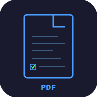
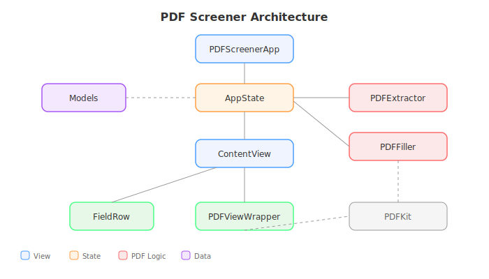

# PDF Screener


Native macOS app that extracts form fields from PDFs, presents them in an editable form, and writes answers back. Built with SwiftUI and PDFKit. No external dependencies.

## Features

- Drag-and-drop PDF loading (or Cmd+O)
- AcroForm field extraction: text, checkbox, radio, dropdown
- Side-by-side layout: editable form fields left, live PDF preview right
- Fill fields inline, save as `_filled.pdf`
- Export/import answers as JSON sidecar (`.answers.json`)

## Architecture



```
PDFScreener/
  PDFScreenerApp.swift    App entry, window config
  AppState.swift          Observable state: PDF doc, fields, load/save
  ContentView.swift       HSplitView: field panel + PDF preview
  FieldRow.swift          Per-field editor (adapts to type)
  PDFViewWrapper.swift    NSViewRepresentable for PDFView
  PDFExtractor.swift      AcroForm widget field extraction
  PDFFiller.swift         Write answers back to annotations
  Models.swift            FormField, FieldType

PDFScreenerTests/
  AppStateTests.swift     State management tests
  ExtractorTests.swift    AcroForm extraction tests
  FillerTests.swift       PDF annotation writing tests
  ModelsTests.swift       Data model tests

docs/
  index.html              Splash page (GitHub Pages)
  style.css               Portfolio-style design system
  CNAME                   pdf.heyitsmejosh.com
```

## Tests

29 XCTests across 4 files covering state management, field extraction, PDF filling, and data models.

```bash
xcodebuild -scheme PDFScreenerTests -destination 'platform=macOS,arch=arm64' test
```

## Build

```bash
cd ~/Documents/Code/pdf
xcodegen generate
open PDFScreener.xcodeproj
# Cmd+R to run
```

CLI build:

```bash
xcodebuild -project PDFScreener.xcodeproj -scheme PDFScreener -configuration Release build
```

Requires macOS 14+, Xcode 16+, xcodegen.

## Usage

1. Open a PDF (Cmd+O or drag-drop)
2. Edit the extracted form fields in the left panel
3. Click **Save Filled** to write a completed `_filled.pdf`
4. Click **Export JSON** to save answers as `.answers.json`

## Pages

Splash page at [pdf.heyitsmejosh.com](https://pdf.heyitsmejosh.com).

## Roadmap

### v0.1.0 -- Core App (current)
- AcroForm field extraction via PDFKit
- Field types: text, checkbox, radio, dropdown
- Inline editing with type-appropriate controls
- Save filled PDF copy
- Export answers as JSON sidecar

### v0.2.0 -- AI Auto-Fill
- "Auto-Fill" button runs codex CLI as subprocess
- Sends extracted field names + surrounding PDF text as context
- Review mode: proposed answers displayed for approval before writing
- Configurable model selection

### v0.3.0 -- Smart Text Detection
- Detect questions from raw PDF text (not just AcroForm)
- Pattern matching: "Name: ___", "Q1.", numbered lists, underlines
- AI-assisted detection: send page text to codex, ask for question boundaries
- Overlay text answers onto non-form PDFs

### v0.4.0 -- Batch + Profiles
- Batch processing: open a folder, process all PDFs
- User profiles: saved answer sets for recurring fields (name, date, student ID)
- Template system: save question-to-answer mappings for reuse
- Progress tracking across batch jobs
- Export summary report of all filled PDFs

### v0.5.0 -- Polish
- Keyboard navigation between fields
- Undo/redo support
- Search/filter fields
- Dark mode refinements
- Menu bar quick-open for recent PDFs

## Tech Stack

SwiftUI, PDFKit, macOS 14+. Zero external dependencies.

## License

MIT 2026 Joshua Trommel
